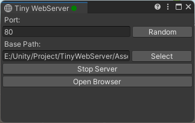

> 本说明有配图，请确保你的网络畅通，图文模式下阅读更佳。

<a id="chinese">[English](#english)</a>

# Tiny Web Server

这是一个简易的 Web Server ，用于方便测试 WebGL 打包后的应用

# 背景

为了测试 WebGL 打包后的应用，架设一个支持 WebGL 的服务器是每个新手的噩梦，几乎 100% 遇到 MIME Type 设置缺失导致的各种加载失败和错误，前期在真空期找资料也是相当的难受

Build And Run 怪好用的，但也不是长远之计，为了运行还要 Build 一次，想想就抵触的紧。

现在，有了 Tiny Webserve ，随时随地想运行就运行~~

# 预览

| Running                             | Stoped                                |
|:-----------------------------------:|:-------------------------------------:|
|  |  |

# 特点

* 0 入侵，0 依赖

* 支持设置端口

* 支持指定服务器根节点

* 支持设置 MIME Type （wip ，p=plan）

* 支持多文件夹托管 （wip，p=plan）

* 支持编辑器程序集重新加载后自动恢复运行状态

* 支持在窗口标题展示服务器运行状态

# 安装

> 通过 git URL 安装

1. 点击 ``Window->Package Manager`` 打开 Package Manager 窗口

2. 将 `https://github.com/Bian-Sh/TinyWebServer.git/?path=TinyWebServer` 粘贴到 Package Manager 中（大小写敏感）

3. 想要支持从 git URL 安装，需要使用 Unity 2019.3.4f1 或更高版本

4. 在中国使用 git URL 安装的成功率较低，请自行选择其他安装方式。

 

# 使用

1. 指定端口，如果端口被占用你又不知道用哪个，请直接点击 "Random"

2. 指定 WebGL 打包的文件夹，这将成为 Web 服务器根节点

3. 点击 “Run Server” 运行服务器，此时按钮会转换至 “Stop Server”

4. 点击 “Stop Server” 停止服务器

5. 点击 “Open Browser” 使用默认浏览器打开 WebGL 应用

# 贡献

> 这个仓库还很年轻，欢迎大家集思广益提供改进建议，任何有趣的想法笔者都会考虑的哦。

# 引用

* 本插件的诞生离不开[【Unity编辑器开发交流群】](https://qm.qq.com/q/w9ylc3xCx2 "点击加群")

* 本插件灵感来自于平日的困惑，而[这个仓库](https://github.com/StinkySteak/unity-webgl-server "unity-webgl-server")就是导火索啦，撒花*★,°*:.☆(￣▽￣)/$:*.°★* 。

## License

遵循 MIT 开源协议

<a id="english">[ Top ↑ ](#chinese)</a>

[Top ↑](#english)
