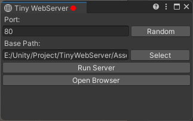

> 本说明有配图，请确保你的网络畅通，图文模式下阅读更佳。

<a id="chinese">[English](#english)</a>

# Tiny Web Server

这是一个简易的 Web Server ，用于方便测试 WebGL 打包后的应用

# 背景

为了测试 WebGL 打包后的应用，架设一个支持 WebGL 的服务器是每个新手的噩梦，几乎 100% 遇到 MIME Type 设置缺失导致的各种加载失败和错误，前期在真空期找资料也是相当的难受

Build And Run 怪好用的，但也不是长远之计，为了运行还要 Build 一次，想想就抵触的紧。

现在，有了 Tiny Webserve ，随时随地想运行就运行~~

# 预览

| Running                                                    | Stoped                                                       |
|:----------------------------------------------------------:|:------------------------------------------------------------:|
|  |  |

# 特点

* 0 入侵，0 依赖

* 支持设置端口

* 支持指定服务器根节点

* 支持设置 MIME Type （wip ，p=plan）

* 支持多文件夹托管 （wip，p=plan）

* 支持编辑器程序集重新加载后自动恢复运行状态

* 支持在窗口标题展示服务器运行状态

# 安装

> 通过 git URL 安装

1. 点击 ``Window->Package Manager`` 打开 Package Manager 窗口

2. 将 `https://github.com/Bian-Sh/TinyWebServer.git/?path=TinyWebServer` 粘贴到 Package Manager 中（大小写敏感）

3. 想要支持从 git URL 安装，需要使用 Unity 2019.3.4f1 或更高版本

4. 在中国使用 git URL 安装的成功率较低，请自行选择其他安装方式。

 

# 使用

1. 指定端口，如果端口被占用你又不知道用哪个，请直接点击 "Random"

2. 指定 WebGL 打包的文件夹，这将成为 Web 服务器根节点

3. 点击 “Run Server” 运行服务器，此时按钮会转换至 “Stop Server”

4. 点击 “Stop Server” 停止服务器

5. 点击 “Open Browser” 使用默认浏览器打开 WebGL 应用

# 贡献

> 这个仓库还很年轻，欢迎大家集思广益提供改进建议，任何有趣的想法笔者都会考虑的哦。

# 引用

* 本插件的诞生离不开[【Unity编辑器开发交流群】](https://qm.qq.com/q/w9ylc3xCx2 "点击加群")

* 本插件灵感来自于平日的困惑，而[这个仓库](https://github.com/StinkySteak/unity-webgl-server "unity-webgl-server")就是导火索啦，撒花*★,°*:.☆(￣▽￣)/$:*.°★* 。

## License

遵循 MIT 开源协议

<a id="english">[ Top ↑ ](#chinese)</a>

# Tiny Web Server

This is a simple Web Server designed to facilitate the testing of WebGL packaged applications.

# Background

Setting up a server that supports WebGL for testing purposes can be a nightmare for beginners. It's almost inevitable to encounter various loading failures and errors due to missing MIME Type settings. Finding resources during the initial stages can be particularly frustrating.

While "Build And Run" is handy, it's not a long-term solution. Having to build every time you want to run something can be off-putting.

Now, with Tiny Web Server, you can run your applications anytime, anywhere!

# Preview

| Running                                                    | Stopped                                                      |
|:----------------------------------------------------------:|:------------------------------------------------------------:|
|  |  |

# Features

* Zero intrusion, zero dependencies

* Customizable port settings

* Customizable server root directory

* Support for setting MIME Types (work in progress, planned)

* Support for multiple directory hosting (work in progress, planned)

* Automatically restores running state after editor assembly reloads

* Displays server running status in the window title

# Installation

> Install via git URL

1. Open the Package Manager window by clicking ``Window->Package Manager``

2. Paste `https://github.com/Bian-Sh/TinyWebServer.git/?path=TinyWebServer` into the Package Manager (case-sensitive)

3. To support git URL installation, Unity 2019.3.4f1 or higher is required

4. Due to lower success rates of git URL installations in China, please consider alternative installation methods.

# Usage

1. Specify the port. If the port is occupied and you don't know which one to use, simply click "Random"

2. Specify the folder containing the WebGL build. This will be the root directory of the Web server

3. Click "Run Server" to start the server. The button will change to "Stop Server"

4. Click "Stop Server" to stop the server

5. Click "Open Browser" to open the WebGL application in the default browser

# Contribution

> This repository is still young. Suggestions for improvements are welcome, and the author will consider any interesting ideas.

# Credits

* This plugin would not have been possible without the [Unity Editor Development Group](https://qm.qq.com/q/w9ylc3xCx2 "Click to join the group")

* The inspiration for this plugin came from everyday challenges, and [this repository](https://github.com/StinkySteak/unity-webgl-server "unity-webgl-server") was the trigger. Cheers! *★,°*:.☆(￣▽￣)/$:*.°★* .

## License

This project is licensed under the MIT License.

<a id="chinese">[ Top ↑](#english)</a>
